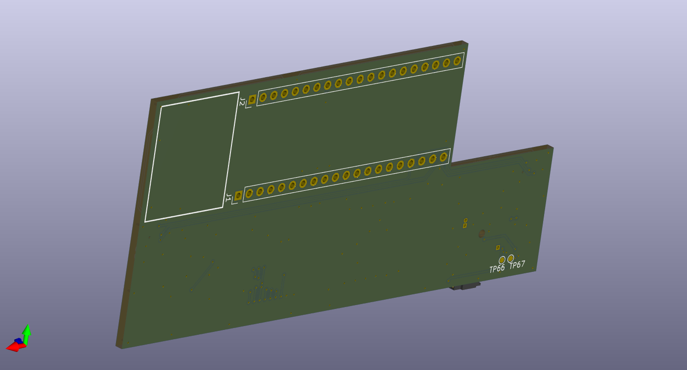
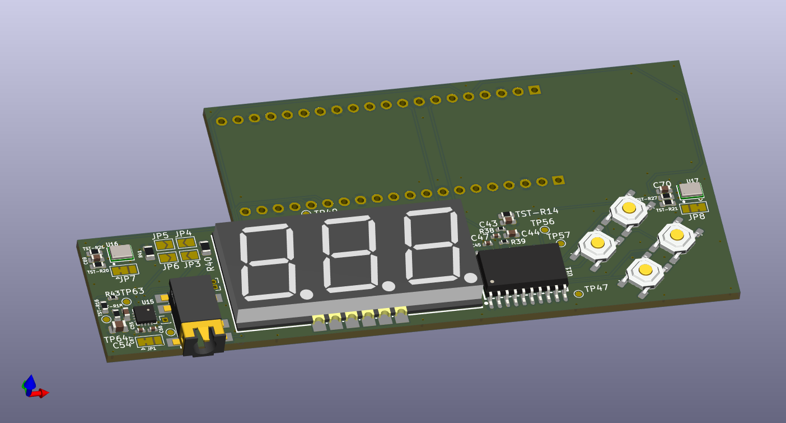

# ESP32S3_Audio_Cam_POE

This is a PCB layout for ESP32S3 with OV2640 / OV5640 camera. This was designeed with KiCAD version 9. 
The boards major features include:
* Camera.
* 2 way audio.
* Hardwired Ethernet including POE.
* Camera pan / tilt servos and lamp control.
* record to SD card.
* Stream video to NVR recording station. 

Changes up to version 0.1:
* Initial layout

## Installation
After cloning, don't forget to check out the submodule. 

TBD currently has not had it's first spin. TBD

## 3D case
See 3D case found here
TBD create file in OnShape and post link here. TBD

## 3D pictures from KICAD

